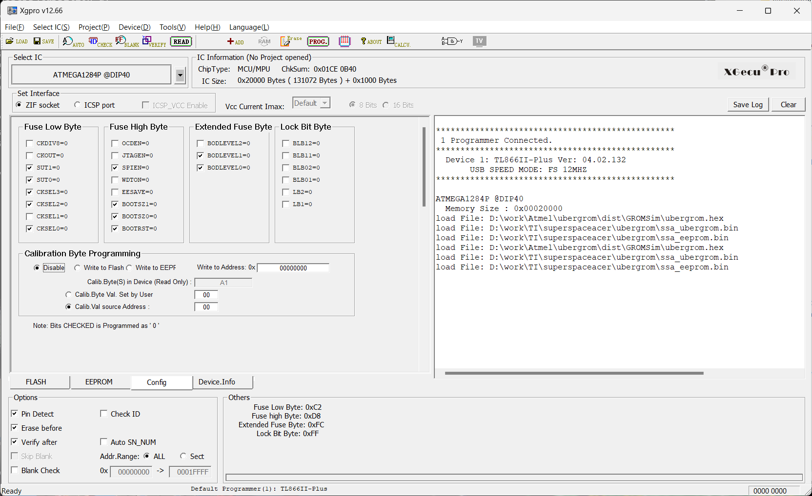
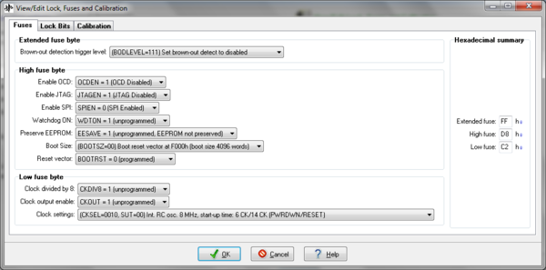

# Burning prebuilt UberGROM cartridge images

This chapter answers the common question: **“I already have the cartridge image files. What do I load, at what offset, and which memory gets programmed?”**

The board contains two independent programmable devices:

- **U3 ATmega1284P** — UberGROM firmware, emulated GROM content, configuration, and optional persistent data.
- **U2 external 512 KiB ROM flash** — the separate bank-switched CPU ROM.

Programming one does not program the other.

## 1. What a complete release should contain

The ATmega Flash image is not normally useful on a **blank** ATmega1284P without the accompanying EEPROM configuration: the EEPROM contains the UberGROM map that determines which physical GROM pages and peripherals appear at which logical GROM locations.

For a complete burn-from-blank release, supply the ATmega side in one of these forms:

| Packaging | Files | Complete for a blank ATmega? |
|---|---|---|
| Combined | one 132 KiB (`>21000`) image | Yes |
| Separate | one 128 KiB (`>20000`) Flash image **plus** one 4 KiB (`>1000`) EEPROM image | Yes |
| Flash-only update | one 128 KiB (`>20000`) Flash image | **No**, unless an already-configured EEPROM is intentionally being preserved |

If the cartridge also uses the separate U2 ROM, add its ROM image (normally 512 KiB / `>80000`). Thus a ROM/GROM release using separate ATmega files commonly contains three files: ATmega Flash, ATmega EEPROM, and U2 ROM.

A GROM-only cartridge legitimately has no U2 ROM image.

## 2. Understand the ATmega programmer-buffer layout

Many universal programmers present ATmega program Flash and EEPROM in one unified file buffer:

```text
Unified programmer/file buffer

>00000 ┌──────────────────────────────────────┐
       │ ATmega1284P program Flash            │
       │ 128 KiB                              │
       │                                      │
>1FFFF └──────────────────────────────────────┘
>20000 ┌──────────────────────────────────────┐
       │ ATmega1284P EEPROM                   │
       │ 4 KiB                                │
>20FFF └──────────────────────────────────────┘
```

The important distinction is:

> `>20000` is the **file/programmer-buffer offset** used to represent the EEPROM after the 128 KiB Flash. The AVR EEPROM is physically a separate memory space whose own address range is `>0000–>0FFF`.

### Combined 132 KiB image

If the supplied file is exactly `>21000` bytes (132 KiB):

1. Select **ATmega1284P**.
2. Load the complete file at buffer address `>00000`.
3. Enable the programmer option usually called **Include EEPROM**, **Program EEPROM**, or equivalent.
4. Program and verify.

The programmer should route:

```text
file >00000–>1FFFF  -> ATmega program Flash
file >20000–>20FFF  -> ATmega EEPROM
```

### Separate 128 KiB Flash + 4 KiB EEPROM

When the release supplies the two images separately:

1. Load the 128 KiB Flash image at `>00000`.
2. **Without clearing the buffer**, load the 4 KiB EEPROM image at `>20000`.
3. Enable **Include EEPROM**.
4. Program and verify both memories.

In a programmer with separate Flash and EEPROM tabs/buffers, the equivalent operation is to load the 128 KiB file into Flash at Flash `>00000` and the 4 KiB file into EEPROM at EEPROM `>0000`.

### Flash-only 128 KiB update image

A 128 KiB Flash-only image should be treated as an **update artifact**, not as a complete blank-device cartridge image.

Use it when the existing EEPROM mapping/save data is intentionally meant to remain in place:

- load the Flash image at `>00000`;
- do not invent or append a 4 KiB EEPROM image;
- preserve/back up the existing EEPROM before the operation.

**Important:** with High fuse `D8`, `EESAVE` is unprogrammed, so a normal AVR Chip Erase does **not** preserve EEPROM. Back up the existing 4 KiB EEPROM first, or use a programmer procedure that explicitly preserves/restores it.

## 3. Internal layout of the 128 KiB ATmega Flash image

For the ATmega1284P build used by this board:

```text
>00000–>1DFFF   120 KiB: fifteen 8 KiB physical GROM pages
>1E000–>1FFFF     8 KiB: UberGROM firmware / boot section
```

This is why a **128 KiB** file contains both cartridge GROM content and Tursi's UberGROM firmware.

The separate 4 KiB EEPROM stores mapping/configuration and can also store application data such as settings or high scores.

## 4. ATmega1284P fuse settings

### Recommended setting for newly programmed boards

Tursi recommends keeping brown-out detection enabled on this 5 V TI cartridge design so the AVR does not begin executing while an aging or slow-rising TI power supply is still below a stable operating voltage.

For the ATmega1284P, his recommended setting is:

| Fuse | Byte |
|---|---:|
| Extended | `FC` |
| High | `D8` |
| Low | `C2` |



### Existing/legacy setting used on many boards

Jon has successfully programmed boards with:

| Fuse | Byte |
|---|---:|
| Extended | `FF` |
| High | `D8` |
| Low | `C2` |



The only difference between `FC/D8/C2` and `FF/D8/C2` is brown-out detection. Existing known-good cartridges do not need to be changed merely because they use `FF`, but **for a newly programmed ATmega1284P this reference recommends `FC/D8/C2`** unless there is a specific reason to disable BOD.

### Document the fuse *functions*, not only the hex bytes

Raw fuse bytes are ATmega1284P-specific. UberGROM was designed to be portable to suitable AVR targets, so a port to another AVR should reproduce the intended **functions** using that device's own fuse definitions rather than blindly copying these bytes.

On the ATmega1284P, AVR fuse bits use `0 = programmed` and `1 = unprogrammed`.

#### Low fuse `C2`

`C2 = 1100 0010`

| Bit/function | Setting | Purpose |
|---|---|---|
| CKDIV8 | 1 | divide-by-8 disabled |
| CKOUT | 1 | clock output disabled |
| SUT1:SUT0 | `00` | startup selection used by this build |
| CKSEL3:0 | `0010` | calibrated internal ~8 MHz RC oscillator |

#### High fuse `D8`

`D8 = 1101 1000`

| Bit/function | Setting | Purpose |
|---|---|---|
| OCDEN | 1 | on-chip debug disabled |
| JTAGEN | 1 | JTAG disabled |
| SPIEN | 0 | serial/ISP programming enabled |
| WDTON | 1 | watchdog not forced always-on |
| EESAVE | 1 | EEPROM **not preserved** by Chip Erase |
| BOOTSZ1:0 | `00` | 4096-word / 8192-byte boot section |
| BOOTRST | 0 | reset vector enters boot section |

For ATmega1284P, the 8192-byte boot area occupies the final 8 KiB of program Flash, matching the UberGROM firmware location at file offsets `>1E000–>1FFFF`.

#### Extended fuse

Only `BODLEVEL2:0` are implemented:

| Extended byte | BODLEVEL | Meaning |
|---|---|---|
| `FC` | `100` | approximately 4.3 V brown-out threshold — **recommended for new boards** |
| `FF` | `111` | brown-out detector disabled — known to work on existing boards, but not preferred for new burns |

### Programmer display differences

Different universal programmers may:

- show only implemented extended-fuse bits;
- mask unused bits;
- label a checked box as “programmed = 0”; or
- display the same functional setting with a different visual convention.

Therefore verify the decoded bit functions, then **read the fuses back** after programming.

## 5. Program the optional external ROM

If the release supplies a U2 ROM image:

1. Select the exact installed 29F040/49F040-compatible part supported by your programmer.
2. Erase the device.
3. Load the ROM image at ROM offset `>00000`.
4. Program without byte swapping.
5. Verify the entire device.
6. Install in the correct orientation.

The board's 74LS378 scheme is **non-inverted**. Images built for older inverted 74LS379 cartridge boards may require 8 KiB bank-order conversion, but a release image intended for this board should be programmed as supplied.

After programming and installing U2, keep **JP1 at 1-2 (`+5V / Write Disable`)**. The current cartridge has no supported in-circuit U2 programming path. Because ROM bank selection itself uses TI write cycles in the cartridge address space, U2's write-enable input is intentionally held inactive during normal use; those writes are for the 74LS378 latch, not for programming U2.

## 6. JP4 while configuring and distributing a cartridge

JP4 is the **UberGROM distribution lock** for the protected ATmega-side write paths.

- **JP4 open:** GROMCFG/FlashCtl can modify GROM Flash and the protected configuration area.
- **JP4 closed:** the released firmware blocks FlashCtl programming and protected configuration/mapping EEPROM writes.

Leave it open while creating/testing a cartridge. Once a finished cartridge is ready for distribution, JP4 may be closed to lock its GROM Flash and mapping while still allowing normal user EEPROM/save-data behavior.

See [Hardware reference](05-hardware-reference.md) for the precise scope.

## 7. First power-on checklist

- Confirm U2 and U3 orientation.
- Confirm the fuse functions and fuse-byte readback.
- Confirm JP8 is in its normal closed position.
- Keep JP4 open if GROMCFG must change GROM Flash or mapping.
- If a separate U2 ROM image was supplied, verify U2 independently.
- Hold **Space** during cold power-up when the UberGROM recovery/GROMCFG path is required.

If a cartridge has GROM but no expected ROM behavior, troubleshoot U2 separately: the ATmega does not program or control U2's contents.

## Source references

- ATmega1284P manufacturer documentation: https://www.microchip.com/en-us/product/atmega1284p
- UberGROM firmware/software by Mike Brent/Tursi: https://github.com/tursilion/ubergrom
