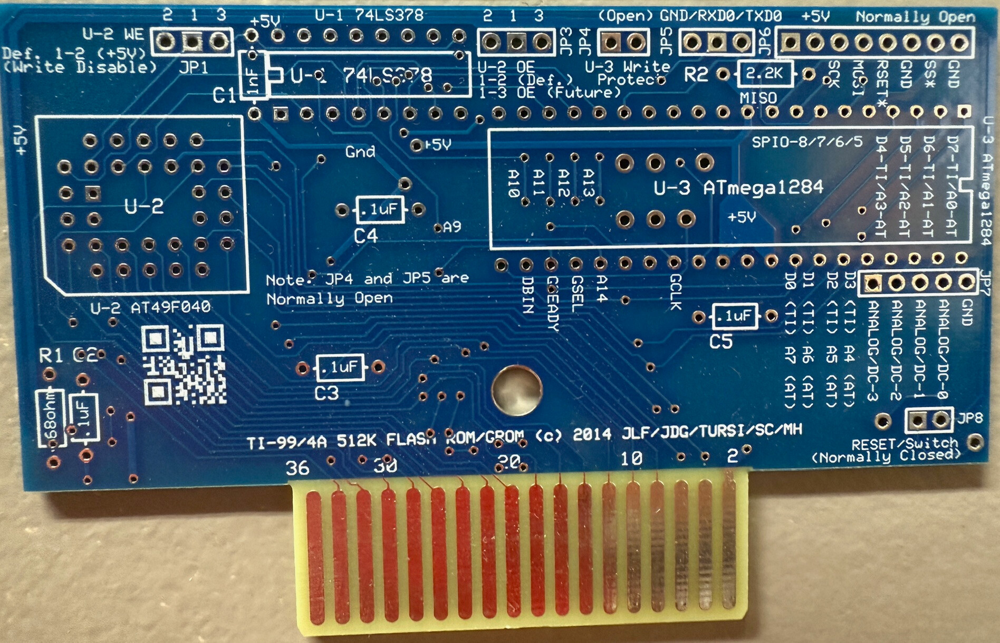
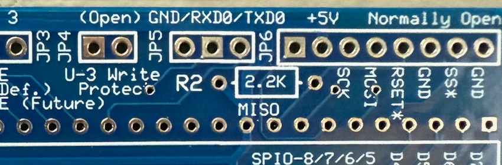

# Hardware reference

The most important hardware concept is that this cartridge contains **two independent programming domains**:

- **U2 external ROM domain** — U2 plus the 74LS378 ROM bank latch and associated ROM control routing.
- **U3 UberGROM domain** — ATmega1284P, its internal Flash/EEPROM/RAM, GROM interface, and peripherals.

There is no ATmega-to-U2 programming path. GROMCFG/FlashCtl cannot program U2, and the U2 ROM banking circuitry cannot alter ATmega memory.



## Major devices

| Ref. | Device | Function |
|---|---|---|
| U1 | 74LS378 | six-bit non-inverting U2 ROM bank latch |
| U2 | 29F040/49F040-class 512 KiB flash | external CPU ROM at `>6000–>7FFF` |
| U3 | ATmega1284P | UberGROM firmware, GROM Flash, SRAM, EEPROM, and peripherals |

## Jumpers and headers at a glance

| Ref. | Domain | Purpose |
|---|---|---|
| JP1 | U2 ROM | U2 `WE` routing; default silkscreen position disables U2 writes |
| JP3 | U2 ROM | U2 `OE` routing; default silkscreen position is the normal ROM setting |
| JP4 | U3 UberGROM | hardware write-protect input used by released firmware |
| JP5 | U3 UberGROM | UART: GND / RXD0 / TXD0 |
| JP6 | U3 UberGROM | ATmega ISP/SPI development header |
| JP7 | U3 UberGROM | four ADC inputs plus ground |
| JP8 | board reset | reset/switch connection, normally closed |

### Do not cross the U2 and U3 descriptions

JP1/JP3 belong to the **external U2 ROM side only**. They do not control:

- ATmega EEPROM;
- ATmega GROM Flash;
- GROMCFG;
- FlashCtl;
- JP4 protection.

Likewise, JP4 belongs to the **ATmega/UberGROM side only** and does not protect or program U2.

The old manual's implication that jumper changes might form a normal in-circuit U2 programming workflow should not be promoted as a supported procedure without a separately verified hardware method. The safe documented programming method for U2 is to program the external ROM device with an appropriate programmer.

## JP1 — U2 WE routing

The PCB silkscreen identifies JP1 as **`U-2 WE`** and marks the default `1-2` position as `+5V / Write Disable`.

For the current board, **leave JP1 in position 1-2 for normal operation**. There is no supported mechanism to program the external 512 KiB U2 Flash in circuit, so moving JP1 to the alternate WE position does not create a usable in-circuit programming mode. Program U2 externally.

The reason the write-disabled position matters is the banking architecture: the TI intentionally performs write cycles in cartridge ROM space to clock the 74LS378 bank latch. U2 itself must remain write-disabled while those bank-select writes occur.

```text
TI write to >6000 + bank×2
        |
        +----> 74LS378 latches the bank address bits
        |
        +----> U2 remains write-disabled (JP1 = 1-2)
```

JP1 is entirely on the U2 side. It has no connection to ATmega EEPROM/configuration or the UberGROM distribution lock at JP4.

## JP3 — U2 OE routing

JP3 is labeled **`U-2 OE`**. Use the PCB's documented default position for normal ROM operation.

JP3 is not a second UberGROM enable or write-protect jumper.

## JP4 — implemented UberGROM write protect

JP4 is labeled **`U-3 Write Protect`** and is normally open.

In Tursi's released firmware, closing JP4 grounds ATmega **PC7**. The firmware checks this input in two places:

### FlashCtl

If PC7 is low, FlashCtl:

- reports result code `2` (write protected); and
- rejects Flash erase/program operations.

This protects the 120 KiB emulated-GROM Flash area from writes through the UberGROM FlashCtl interface.

### EEPROM configuration

For persistent EEPROM writes, the firmware checks JP4 when the EEPROM address is below `>0102`.

With JP4 closed, persistent writes to:

```text
>0000–>0101
```

are rejected. This protects the mapping/configuration portion of EEPROM.

### Distribution-lock behavior

JP4 was specifically intended as a **distribution lock**. It protects the cartridge's GROM Flash and mapping/configuration from ordinary TI-side modification while intentionally leaving these resources usable:

- RAM;
- normal user EEPROM at `>0102` and above;
- the independent U2 external ROM subsystem.

This lets a finished cartridge keep writable settings, saves, or high scores without leaving the cartridge image and mapping open to GROMCFG/FlashCtl modification.

### Practical use

- Leave JP4 **open** while using GROMCFG to create or modify the cartridge.
- After final configuration and testing, close JP4 to apply the distribution lock.
- Open it again whenever protected GROM Flash or mapping must be changed.

## JP5 — UART

The PCB labels JP5:

```text
GND / RXD0 / TXD0
```

It is normally open.

The UART uses **5 V TTL** logic. Do not connect it directly to a traditional ±RS-232 serial interface. Use an appropriate level converter or a serial adapter confirmed compatible with 5 V TTL signaling.

## JP6 — ATmega ISP/SPI header

JP6 exposes the development/programming signals used around the ATmega1284P.



| JP6 pin | Signal | ATmega1284P function |
|---:|---|---|
| 1 | `MISO` | PB6 / ISP MISO |
| 2 | `+5V` | target supply/reference |
| 3 | `SCK` | PB7 / ISP clock |
| 4 | `MOSI` | PB5 / ISP MOSI |
| 5 | `RSET*` | active-low RESET |
| 6 | `GND` | ground |
| 7 | `SS*` | PB4 / active-low SPI select |
| 8 | `GND` | ground |

### Normal AVR ISP signals

For ordinary AVR ISP programming, the essential signals are:

```text
MISO
MOSI
SCK
RSET*
VCC/reference
GND
```

`SS*` is exposed for SPI/development use and is not normally required by a standard AVR ISP operation.

### Connection cautions

- Remove the cartridge from the TI before ISP programming.
- Do not power the target simultaneously from the TI and an external programmer.
- Determine whether the programmer's VCC pin **supplies power** or is only a **target-voltage reference**.
- JP6 does not use the standard keyed 6-pin AVR ISP physical arrangement, so an adapter cable may be necessary.
- `RSET*` and `SS*` are active low.

A socketed ATmega may instead be removed and programmed directly in a universal programmer.

## JP7 — four ADC inputs

JP7 exposes:

```text
ADC0
ADC1
ADC2
ADC3
GND
```

These are the four analog channels used by the standard board/firmware combination.

Observe the ATmega electrical limits. The original UberGROM interface treats the conversion range as 0–5 V on this 5 V design.

## JP8 — reset connection

JP8 is normally closed and connects the board to the cartridge reset signal.

Opening it is for an external reset/switch arrangement, not normal cartridge operation.

## ROM and UberGROM writes are different operations

Three different “write” concepts exist and should never be conflated:

1. **ROM bank-select write** — TMS9900 writes to `>6000 + bank×2`; changes 74LS378 latch state only.
2. **UberGROM FlashCtl/EEPROM write** — TI GROM accesses handled by ATmega firmware; JP4 can block protected writes.
3. **Device programming** — an external programmer physically programs U2 or U3.

Keeping those three paths separate prevents most of the jumper/programming confusion in the older documentation.

## Source references

- UberGROM firmware by Mike Brent/Tursi: https://github.com/tursilion/ubergrom
- `eeprom.c`: hardware write-protect check for EEPROM configuration
- `flash.c`: hardware write-protect check and FlashCtl result code
- final PCB silkscreen and schematic for jumper labels
